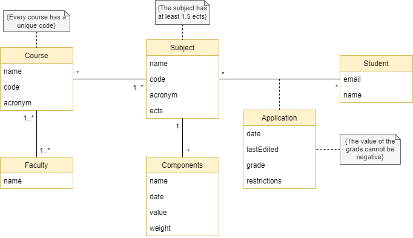

# Domain Model

A Domain Model is a type of model used to represent a system in a simplified way. This model is helpful for organizing the vocabulary and capturing information requirements of the problem domain.

## UML

To better understand the context of the S.U.P? system, it is very useful to have a UML class diagram with all the key concepts and relationships involved in our module.

 

  

## Description  

Short textual description of each class of the UML class diagram.

| Class | Description |
| --- | --- |
| *Faculty* | The class Faculty has the attribute name. A Faculty can have 1 or more courses. |
| *Course* | Each Course has a name, a code and an acronym. A course belongs to one or more faculty. Every course has a unique code. Each course has at least one subject. |
| *Subject* | Each Subject has a name, a code and an acronym. Every subject has a unique code. Each subject has a number of ects and a grade associated with it, that is given to the student if he gets a passing grade on the subject. Each subject has at least 1.5 ects. The same subject can be part of different courses. The attribute lastEdited holds the last date when the formula (to calculate the final grade) was changed. The restrictions are the information that a student needs to know in order to register or complete a subject. |
| *Student* | Each Student has a name and an email. A student has to register in a faculty in order to attend a course and its subjects. A student can repeat a subject as many times as he wants. |
| *Components* | Each Components object has a name, a date, a value and a weight. For example, if the component is an exam, then its date is when the exam happens. The value is the grade the student receives on this component, and the component's weight can vary over time. Every component must have a value greater or equal to zero. |
| *Application* | This association class has information about whether or not this is the first time the student is enrolled in the subject or not. If it isn't, the student may use the information/grades of the last year, in order to calculate the grade for that subject. |