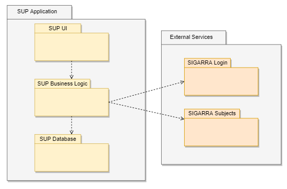

# Logical Architecture

To better understand the context of the S.U.P? application, it is very useful to document the high-level logical structure of the code (Logical View), using a UML diagram with logical packages, without the worry of allocating to components, processes or machines.

## UML

## Description

| Name               | Description |
| ------------------ | ----------- |
| SUP UI             | This package includes all of ***SUP?***'s user interfaces, from a page without any user input, eg. the *About US* page, to a more complex page where almost all elements are following the user's preference, eg. the *Subjects* page.
| SUP Business Logic | This package includes all of ***SUP?***'s business logic, in other words, it contains a conglomeration of processes, for eg. handling the user inputs, comunicating with the *External Services* and reading and loading the database.
| SUP Database       | This package includes ***SUP?***'s database, meaning that it's responsible for saving the user's information.
| SIGARRA Login      | This package includes information about the credentials used to login into the SIGARRA's services. 
| SIGARRA Subjects   | This package includes information about the subjects that are stored in SIGARRA's services.

