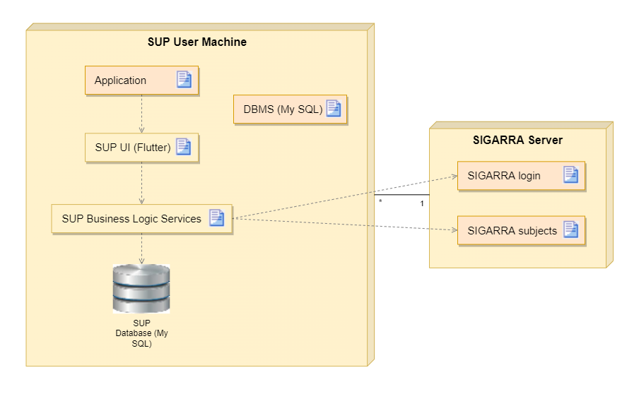

# Physical Architecture

In order to understand in a better way the software system of the S.U.P? application and the hardware involved with it, here is a UML diagram (Deployment View) which presents the information regarding this topic. This scheme describes the structure formed by the technologies used during the execution of the program. 

## UML

## Description

| Name          | Description |
| ------------- | ----------- |
| Application | This artifact represents the application itself, which is available in the user device.|
| SUP UI (Flutter) | This artifact represents the interaction between the user/client and the SUP application. |
| SUP Business Logic Service | This artifact represents the system that translates the user's requests into the corresponding   requests to the SIGARRA server. |
| DBMS (My SQL) | This artifact represents the software used for data management and it's associated with the   SUP Server Machine node. |
| SIGARRA login | This artifact represents the system that allows logging into SUP through SIGARRA. |
| SIGARRA subjects | This artifact represents the system that allows the gathering of data from SIGARRA. |