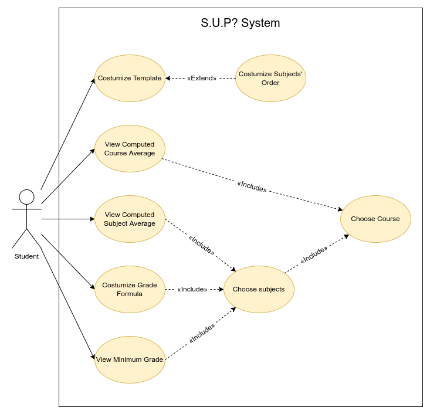

# 2LEIC05T3

## Members

| Student Name | Student number |
| --- | --- |
| Afonso Dias | 202006721 |
| Clarisse Carvalho | 202008444 |
| Francisco Prada | 202004646 | 
| Isabel Silva | 201904925 |
| Rafael Camelo | 201907729 |

## Product Name
S.U.P?

## Vision Stament
To help students cope with their pre-exam stress, *Shall You Pass?*, intends to give users a bug free, easy and fast way to determine their subject's grade and possible minimum exam grade.

No more human errors. No more *Oh I didn't know*'s. No more wasted time manually computing subjects' grades. 

## Main Features

| Feature | Name | Description |
| --- | --- | --- |
| F01 | Subject average | Based on user input for different projects/tests/exams compute the subject's grade. |
| F02 | Course average | Based on user input on different subjects, compute the course average taking into account the weight (ECTS) of each subject. |
| F03 | Minimum exam grade | Based on user input for different projects/tests/exams calculate the minimum grade needed on the next exam that allows the user to still pass the subject. |
| F04 | Costumize grade formula | Allow the user to switch the current grade computation formula to one choosen by the user. |
| F05 | Alter grade components | Allow the user to add/remove projects/tests/exams that are used on the grade formula. |
| F06 | Costumization options | Allow the user to change the overall feel of the app. eg. colors, subject's order. |
| F07 | Recomend components grade's | Based on user input for their choosen grade on any given subject recommend grades to get on different components (recomendation formula to be discussed later). |
| F08 | Notes | Allow the user to take small notes inside the app and attatch them to any subject. |

## Required API's

| API | Description |
| --- | --- |
| User's *SIGARRA* profile | It would speed up the time required to input data if we already had some of that data, that is data that refers to the student's grades and any given subject and data that refers to the current courses that the student has. |
| Subject's *SIGARRA* page | It would help out the devs of the app if in the beginning of each semester the app could retrieve all the subject's grade's formula and automatically add/update it. |

## Use cases

To clarify the context and boundaries of the S.U.P? system, it is very useful to have a UML use-case diagram with all high-level use cases addressed in our module. 

 

  

### Individual use cases

| UseCase001 | Description |
| --- | --- |
| *Name* | Customize template |
| *Actor* | Student |
| *Description* | Allow the student to change the overall design of the app. eg. colors, subject's order. |
| *Preconditions* | *None* |
| *Postconditions* | - The system saves the student changes to the app. |
| *Normal flow* | 1. The student opens the app.   2. The student chooses to costumize the template, by clicking on the corresponding option.   3. The app shows the available options of changes that can be made.   4. Finally, the student chooses the options and the changes are made and saved. | 	      
| *Alternative flows and exceptions* | 1. [No changes] If there are no changes made, the system stays the same. |

| UseCase002 | Description |
| --- | --- |
| *Name* | Customize subjects' order |
| *Actor* | Student |
| *Description* | The student has the option to re-order the subjects that they selected. |
| *Preconditions* | - The student must have choosen a subject. |
| *Postconditions* | - The subjects' order changes according to the students' desire. |
| *Normal flow* | 1. The student opens the app.   2. The student chooses their course from a list of options.   3. The students then chooses their subjects.   4. The students then chooses the order in which is displayed. |
| *Alternative flows and exceptions* | 1. [No elements] If there's no course or subject chosen, the student can't reorder their subjects. |

| UseCase003 | Description |
| --- | --- |
| *Name* | View computed course average |
| *Actor* | Student | 
| *Description* | The student's course average will be computed and displayed. |
| *Preconditions* | - The student is enrolled in a course.   - The student is enrolled in one or more subjects. |
| *Postconditions* | - The calculated course average will be shown to the student. | 
| *Normal Flow* | 1. The student opens the app.   2. The student chooses their course from a list of options.   3. The student chooses their subjects.   4. The student inputs their grades into the app.   5. The app computes and displays their grade. |
| *Alternative flows and exceptions* | 1. [Repetitive grade] If there's already a final grade insert in SIGARRA for a certain subject, there won't be a need for steps 4. and 5..   2. [Missing data] If the student doesn't input their grades in the different subjects, the app is not able to compute the course average and, therefore, it can not be displayed. |

| UseCase004 | Description |
| --- | --- |
| *Name* | View computed subject average |
| *Actor* | Student |
| *Description* | The student's subject average will be computed and displayed. |
| *Preconditions* | - The student is enrolled in a subject. |
| *Postconditions* | - The calculated subject average will be shown to the student. |
| *Normal flow* | 1. The student opens the app.   2. The student chooses their course from a list of options.   3. The students then chooses their subjects.   4. The student adds their grades on the different components of that subject.   5. The system will compute the subject's grade.   6. The app will display the given average. |
| *Alternative flows and exceptions* | 1. [Repetitive grade] If there's already a final grade insert in SIGARRA for that subject there won't be a need for steps 4. and 5..   1. [No options selected] If there's no course or subject chosen, the app can't compute subjects average. |

| UseCase005 | Description |
| --- | --- |
| *Name* | Customize grade formula |
| *Actor* | Student |
| *Description* | Allows the student to create the formula which is necessary to compute the final grade of a subject or course. |
| *Preconditions* | - The course must already be choosen.   - The subjects must already be choosen. |
| *Postconditions* | - The grade formula must be valid.   - The system saves the changed formula for future calculations. |
| *Normal flow* | 1. The student opens the app.  2. The student chooses the course.   3. The student chooses the subjects.   4. The student then chooses to customize the grade formula.   5. The system asks what subject the student wishes to create/change.   7. The student customizes the formula.   8. The formula is saved. |	
| *Alternative flows and exceptions* | 1.[Invalid Formula] The student can not input a invalid grade formula, it will throw an error "Invalid formula" and ask for the user to create another one. |

| UseCase006 | Description |
| --- | --- |
| *Name* | View minimum grade |
| *Actor* | Student |
| *Description* | After the student chooses a given subject and inputs their grades on each of different components the app should compute and then show de minimum grade needed to pass the subject on the final exam. |
| *Preconditions* | - The student must have choosen a subject. |
| *Postconditions* | None | 
| *Normal flow* | 1. The student opens the app.   2. The student chooses their course.   3. The student chooses their desired subject.   4. The student inputs the grades they received in the different components of that subject.  5. The app computes and afterwards shows the minimum grade needed in the different components with the information given. |
| *Alternative flows and exceptions* | 1. [No grade] If the grade isn't computed, on step 5., there won't be a shown grade.   2. [Missing components] If the user didn't fufill any of the necessary components there won't be a shown grade. |

| UseCase007 | Description |
| --- | --- |
| *Name* | Choose subjects |
| *Actor* | Student |
| *Description* | The student can track one or more subjects on the app. |
| *Preconditions* | - The student must have choosen a preset course. |
| *Postconditions* | - The number of subjects associated with a student should increase.  - The subjects average should be displayed.  - The courses grade computation should include this new subject.
| *Normal flow* | 1. The student opens the app.   2. The student chooses their course from a list of preset options.   3. The students then chooses the subjects that they wish to include. |
| *Alternative flows and exceptions* | *None* |

| UseCase008 | Description |
| --- | --- |
| *Name* | Choose course |
| *Actor* | Student | 
| *Description* | The student can choose one or more courses in which they are enrolled. | 
| *Preconditions* | *None* |
| *Postconditions* | - The number of courses associated with a student should increase.  - The course's average should be displayed. |
| *Normal Flow* | 1. The student opens the app.  2. The app shows all the courses currently available at the university.   3. The user chooses the course(s) in which they are enrolled. | 
| *Alternative flows and exceptions* | *None* |

## Domain Model

A Domain Model is a type of model used to represent a system in a simplified way. This model is helpful for organizing the vocabulary and capturing information requeriments of the problem domain.

### UML

To better understand the context of the S.U.P? system, it is very useful to have a UML class diagram with all the key concepts and relationships involved in our module.

 

  

### Description  

Short textual description of each class of the UML class diagram.

| Class | Description |
| --- | --- |
| *Faculty* | The class Faculty has the attribute name. A Faculty can have 1 or more courses. |
| *Course* | Each Course has a name, a code and an acronym. A course belongs to one or more faculty. Every course has a unique code. Each course has at least one subject. |
| *Subject* | Each Subject has a name, a code and an acronym. Every subject has a unique code. Each subject has a number of ects and a grade associated with it, that is given to the student if he gets a passing grade on the subject. Each subject has at least 1.5 ects. The same subject can be part of different courses. The attribute lastEdited holds the last date when the formula (to calculate the final grade) was changed. The restrictions are the information that a student needs to know in order to register or complete a subject. |
| *Student* | Each Student has a name and an email. A student has to register in a faculty in order to attend a course and its subjects. A student can repeat a subject as many times as he wants. |
| *Components* | Each Components object has a name, a date, a value and a weight. For example, if the component is an exam, then its date is when the exam happens. The value is the grade the student receives on this component, and the component's weight can vary over time. Every component must have a value greater or equal to zero. |
| *Application* | This association class has information about whether or not this is the first time the student is enrolled in the subject or not. If it isn't, the student may use the information/grades of the last year, in order to calculate the grade for that subject. |

## Elevator Pitch

Have you ever thought about what grade you need on the final exam to pass that subject that has been bugging you all semester?
Well worry no more! ***SHALL YOU PASS?*** is new and intuitive app that helps you, a student in need, a student going through hard times, a student that's stressed with all the slides they still need to read and comprehend!\
***SUP?*** allows you to quickly input the grades that you do have and gives you the one that you need!
We came together to help students across campus, from the ones that hate lectures to the ones that laugh at a professor’s joke, now no one should worry with over-complicated math before an exam, just focus on your study and help ***SUP?*** help you!
