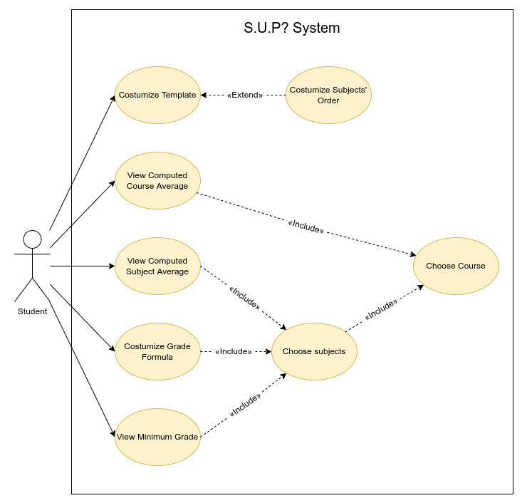

# Use cases

To clarify the context and boundaries of the S.U.P? system, it is very useful to have a UML use-case diagram with all high-level use cases addressed in ouu module. 

 

  

## Individual use cases

| UseCase001 | Description |
| --- | --- |
| *Name* | Customize template |
| *Actor* | Student |
| *Description* | Allow the student to change the overall design of the app. eg. colors, subject's order. |
| *Preconditions* | *None* |
| *Postconditions* | - The system saves the student changes to the app. |
| *Normal flow* | 1. The student opens the app.   2. The student chooses to costumize the template, by clicking on the corresponding option.   3. The app shows the available options of changes that can be made.   4. Finally, the student chooses the options and the changes are made and saved. | 	      
| *Alternative flows and exceptions* | 1. [No changes] If there are no changes made, the system stays the same. |

| UseCase002 | Description |
| --- | --- |
| *Name* | Customize subjects' order |
| *Actor* | Student |
| *Description* | The student has the option to re-order the subjects that they selected. |
| *Preconditions* | - The student must have choosen a subject. |
| *Postconditions* | - The subjects' order changes according to the students' desire. |
| *Normal flow* | 1. The student opens the app.   2. The student chooses their course from a list of options.   3. The students then chooses their subjects.   4. The students then chooses the order in which is displayed. |
| *Alternative flows and exceptions* | 1. [No elements] If there's no course or subject chosen, the student can't reorder their subjects. |

| UseCase003 | Description |
| --- | --- |
| *Name* | View computed course average |
| *Actor* | Student | 
| *Description* | The student's course average will be computed and displayed. |
| *Preconditions* | - The student is enrolled in a course.   - The student is enrolled in one or more subjects. |
| *Postconditions* | - The calculated course average will be shown to the student. | 
| *Normal Flow* | 1. The student opens the app.   2. The student chooses their course from a list of options.   3. The student chooses their subjects.   4. The student inputs their grades into the app.   5. The app computes and displays their grade. |
| *Alternative flows and exceptions* | 1. [Repetitive grade] If there's already a final grade insert in SIGARRA for a certain subject, there won't be a need for steps 4. and 5..   2. [Missing_data] If the student doesn't input their grades in the different subjects, the app is not able to compute the course average and, therefore, it can not be displayed. |

| UseCase004 | Description |
| --- | --- |
| *Name* | View computed subject average |
| *Actor* | Student |
| *Description* | The student's subject average will be computed and displayed. |
| *Preconditions* | - The student is enrolled in a subject. |
| *Postconditions* | - The calculated subject average will be shown to the student. |
| *Normal flow* | 1. The student opens the app.   2. The student chooses their course from a list of options.   3. The students then chooses their subjects.   4. The student adds their grades on the different components of that subject.   5. The system will compute the subject's grade.   6. The app will display the given average. |
| *Alternative flows and exceptions* | 1. [Repetitive grade] If there's already a final grade insert in SIGARRA for that subject there won't be a need for steps 4. and 5..   1. [No options selected] If there's no course or subject chosen, the app can't compute subjects average. |

| UseCase005 | Description |
| --- | --- |
| *Name* | Customize grade formula |
| *Actor* | Student |
| *Description* | Allows the student to create the formula which is necessary to compute the final grade of a subject or course. |
| *Preconditions* | - The course must already be choosen.   - The subjects must already be choosen. |
| *Postconditions* | - The grade formula must be valid.   - The system saves the changed formula for future calculations. |
| *Normal flow* | 1. The student opens the app.  2. The student chooses the course.   3. The student chooses the subjects.   4. The student then chooses to customize the grade formula.   5. The system asks what subject the student wishes to create/change.   7. The student customizes the formula.   8. The formula is saved. |	
| *Alternative flows and exceptions* | 1.[Invalid Formula] The student can not input a invalid grade formula, it will throw an error "Invalid formula" and ask for the user to create another one. |

| UseCase006 | Description |
| --- | --- |
| *Name* | View minimum grade |
| *Actor* | Student |
| *Description* | After the student chooses a given subject and inputs their grades on each of different components the app should compute and then show de minimum grade needed to pass the subject on the final exam. |
| *Preconditions* | - The student must have choosen a subject. |
| *Postconditions* | None | 
| *Normal flow* | 1. The student opens the app.   2. The student chooses their course.   3. The student chooses their desired subject.   4. The student inputs the grades they received in the different components of that subject.  5. The app computes and afterwards shows the minimum grade needed in the different components with the information given. |
| *Alternative flows and exceptions* | 1. [No grade] If the grade isn't computed, on step 5., there won't be a shown grade.   2. [Missing components] If the user didn't fufill any of the necessary components there won't be a shown grade. |

| UseCase007 | Description |
| --- | --- |
| *Name* | Choose subjects |
| *Actor* | Student |
| *Description* | The student can track one or more subjects on the app. |
| *Preconditions* | - The student must have choosen a preset course. |
| *Postconditions* | - The student can view their subject average.   - The student can then input their grade for that subject.   - The student can then input different components for grade computation purposes.   - The student can then get the minimum grade they'll need to pass the subject.   - The student can customize the formula used for that subject's grade computation.   - The student can then costumize the order that the subjects appear in the app.
| *Normal flow* | 1. The student opens the app.   2. The student chooses their course from a list of preset options.   3. The students then chooses the subjects that they wish to include. |
| *Alternative flows and exceptions* | *None* |

| UseCase008 | Description |
| --- | --- |
| *Name* | Choose course |
| *Actor* | Student | 
| *Description* | The student can choose one or more courses in which they are enrolled. | 
| *Preconditions* | *None* |
| *Postconditions* | - The student can view the subjects in which they are enrolled.   - The student can view their course average.   - The student can choose different subjects for any given course.   - The student can costumize the grade calculation formula. |
| *Normal Flow* | 1. The student opens the app.  2. The app shows all the courses currently available at the university.   3. The user chooses the course(s) in which they are enrolled. | 
| *Alternative flows and exceptions* | *None* |
